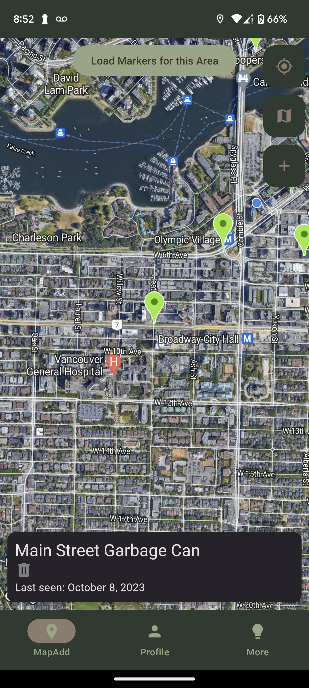
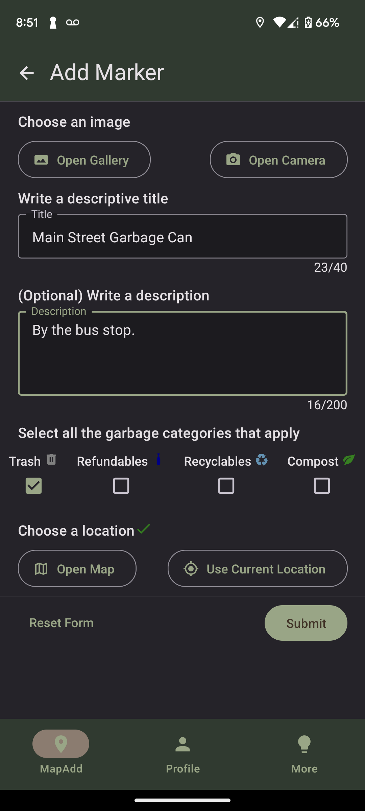
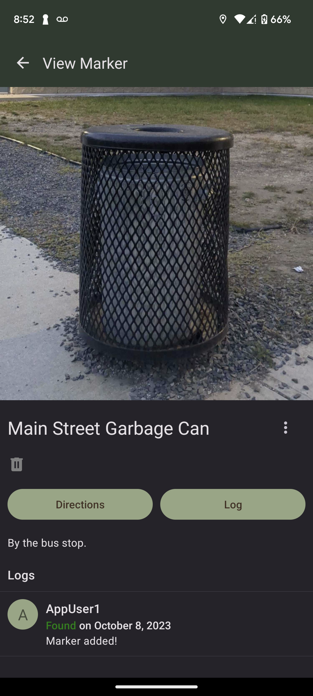
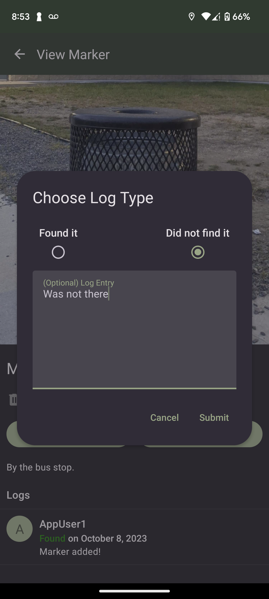
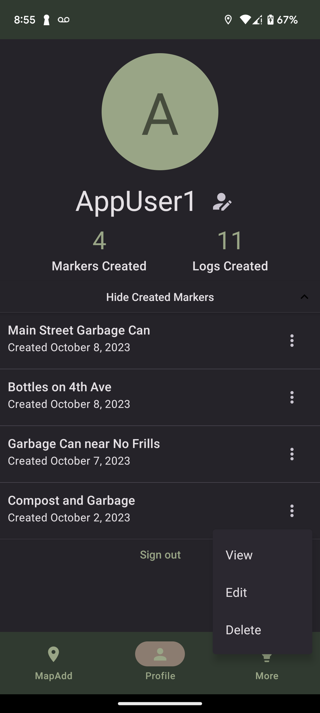
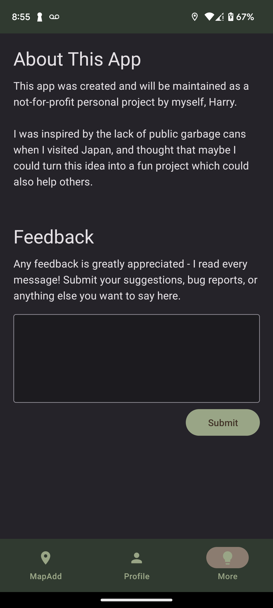

# Garbage Map App

The Garbage Map App is a user-friendly mobile application developed using React Native. It allows users to crowdsource and monitor the locations of trash bins on a map, promoting environmental awareness and waste management.

This personal project was inspired by my trip to Japan where I noticed that public garbage bins were very scarce. I developed the app by myself from scratch all the way to deployment on the Play Store. Maintaining and improving the app is currently an ongoing process!

Download the latest version of the app from the Play Store [here](https://play.google.com/store/apps/details?id=com.anonymous.JapanGarbageMap)!

## Features

This app allows users to:

- View trash bin locations on an interactive map.
- Click on trash bin markers to access information such as garbage type (trash, recyclables, refundables, compost) and user logs.
- Log trash bin status as "found" or "could not find" to help others know if the bin is still present.
- Edit, or delete markers you've created.
- Report inappropriate markers.
- Submit feedback about the app to improve user experience.
- Toggle between different map types based on user preference.

Additional features:

- Light and dark theme automatically selected based on your device theme.

## Example Screens

## Technologies Used

- React Native
- Google Maps API
- Firebase Authentication
- Firebase Cloud Storage
- Firestore Database

## Usage

1. Launch the app on your Android device.
2. (Optional) Sign in or create an account using Firebase Authentication. This is required to create logs or add garbage markers.
3. Explore and contribute to garbage bin locations on the map.
4. Interact with markers to view details and log status.
5. Report inappropriate markers and provide feedback to enhance the app.

## Contact Information

For questions, suggestions, or issues, please contact [me](https://linkedin.com/in/harrytyhu)!
